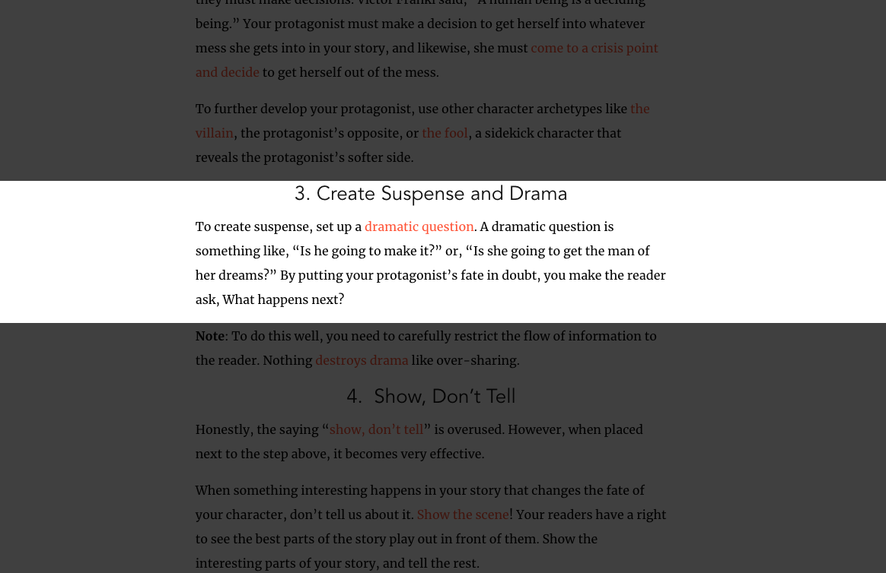
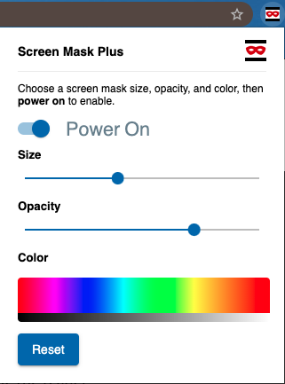

# Screen Mask Plus

A website and web document reading aid with accessibility controls and the ability to update opacity and color.  Screen Mask Plus provides accessibility controls and the ability to update the opacity and color.





## Demo

You can install via the [Chrome Web Store](https://chrome.google.com/webstore/detail/screen-mask-plus/bpeihkjhbgegaknjckcihmiboldjihmm).

## License

MIT details can be found [here](license.md)

## Get Started

Clone the repo and install the dependencies.

```
npm i
```

This is an angular-cli (angular 9) project, so you may want to install this globally.

```
npm i angular/cli@9.x.x -g
```

Test the extension

```
npm run test
```

Build the extension

```
npm run build
```

Verify build

1. Open chrome extension (**chrome://extensions/**)
2. Toggle **Developer mode**
3. **Load unpacked** extension
4. Select the **dist** directory for your build
5. Click the Screen Mask icon  on your Chrome extension bar 


Note: This extension will not work on the extensions page or the Chrome Web Store as a security precaution.
